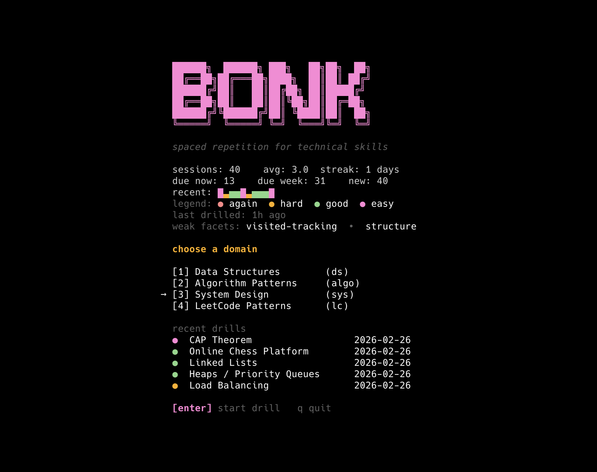
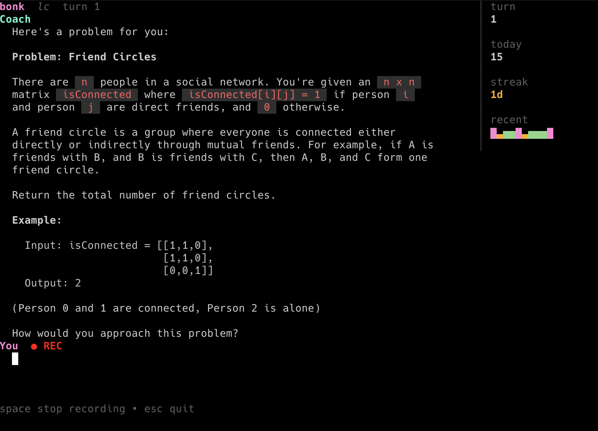

<h1 align="center">bonk</h1>

<p align="center"><strong>Socratic interview drills with spaced repetition</strong></p>

<p align="center">
  <a href="https://github.com/vishrutdixit/bonk/actions/workflows/ci.yml"></a>
  <a href="https://go.dev/"></a>
  <a href="https://github.com/vishrutdixit/bonk/releases"></a>
  <a href="https://github.com/vishrutdixit/bonk/stargazers"></a>
</p>

`bonk` is a terminal app for technical interview prep. It asks probing follow-ups, adapts to your answers, and schedules reviews with SM-2 so you revisit skills at the right time.

<p align="center">
  &nbsp;&nbsp;&nbsp;&nbsp;
  
</p>

## Installation

```bash
brew tap vishrutdixit/tap
brew install bonk
```

Set your API key and run:

```bash
export ANTHROPIC_API_KEY=your_key_here
bonk
```

Build from source:

```bash
go build -o bin/bonk ./cmd/bonk
```

## Why Bonk

- Infinite, self-improving deck of concepts to drill
- Conversation-first practice instead of flashcard memorization
- Smart next-skill selection: due -> new -> random

## Common Commands

```bash
bonk                       # Start drilling (recommended)
bonk ds                    # Data structures only
bonk algo                  # Algorithm patterns only
bonk sys                   # System design concepts
bonk sysp                  # System design interviews (practical)
bonk lc                    # LeetCode patterns only
bonk --skill hash-maps
bonk list
bonk info hash-maps
bonk review                # Review last session transcript
bonk review --feedback     # Get AI feedback on your performance
bonk version
```

## Voice Mode

Practice explaining concepts out loud (macOS only):

```bash
bonk --voice
```

- Coach questions are spoken aloud
- Press `space` to record your answer
- Press `s` to skip speech

## Mobile / Remote Drill

```bash
brew install ttyd
bonk serve
```

Open the printed URL from your phone. Works on the same WiFi, or anywhere via Tailscale (auto-detected).

## Configuration

- `ANTHROPIC_API_KEY` (required)
- `BONK_MODEL` (optional, defaults to `claude-sonnet-4-20250514`)

## For Contributors

See [CONTRIBUTING.md](CONTRIBUTING.md).

## License

MIT
