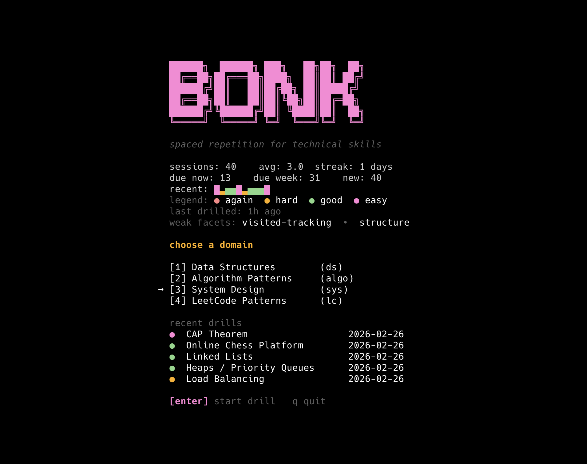
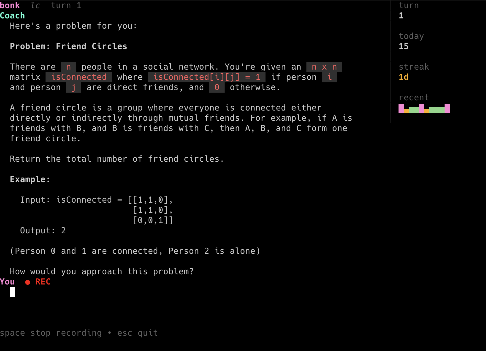

<h1 align="center">bonk</h1>

<p align="center"><strong>Socratic interview drills with spaced repetition</strong></p>

<p align="center">
  <a href="https://github.com/vishrutdixit/bonk/actions/workflows/ci.yml"></a>
  <a href="https://go.dev/"></a>
  <a href="https://github.com/vishrutdixit/bonk/releases"></a>
  <a href="https://github.com/vishrutdixit/bonk/stargazers"></a>
</p>

<p align="center">
  &nbsp;&nbsp;&nbsp;&nbsp;
  
</p>

> *I was trying to use an LLM as a learning tool for CS concepts. This isn't a new concept -- people have been using LLMs for learning for a while. But it was doing a great job of strengthening my understanding. I then was reminded of how my wife used to do Anki spaced repetition drills in medical school to study. This is super common among med students. They download decks / flashcards and drill them. I then had the idea that I can use GenAI to make **infinite** decks. Yes, it's a tiny wrapper around LLMs, but it provides a ton of value. The deck seed material can grow over time. We can add different concepts, facets, etc. That's the idea.*

## Installation

```bash
brew tap vishrutdixit/tap
brew install bonk
```

Set your API key and run:

```bash
export ANTHROPIC_API_KEY=your_key_here
bonk
```

Build from source:

```bash
go build -o bin/bonk ./cmd/bonk
```

## Common Commands

```bash
bonk                       # Start drilling (recommended)
bonk ds                    # Data structures only
bonk algo                  # Algorithm patterns only
bonk sys                   # System design concepts
bonk sysp                  # System design interviews (practical)
bonk lc                    # LeetCode patterns only
bonk --skill hash-maps
bonk list
bonk info hash-maps
bonk review                # Review last session transcript
bonk review --feedback     # Get AI feedback on your performance
bonk version
```

Open the printed URL from your phone. Works on the same WiFi, or anywhere via Tailscale (auto-detected).

## Configuration

- `ANTHROPIC_API_KEY` (required)
- `BONK_MODEL` (optional, defaults to `claude-sonnet-4-20250514`)

## For Contributors

See [CONTRIBUTING.md](CONTRIBUTING.md).

## License

MIT
